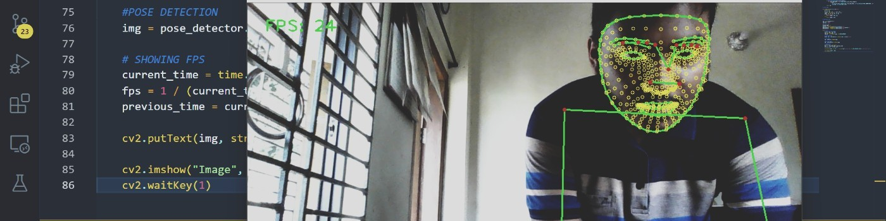

# Hey, I'm Naimur, Welcome! 



## Passionate Full Stack Web Developer | Problem Solver Extraordinaire | Uniting Design and Functionality
## Find out more about me & feel free to connect with me here:
<p align="center">
  	<a href="https://dev.naimur29.com/" target="_blank">
		
	</a>
 	<a href="https://www.linkedin.com/in/naimur-rahman-799769202/" target="_blank">
		
	</a>
	<a href="https://naimur29.hashnode.dev/" target="_blank">
		
	</a>
	<a href="https://dev.naimur29.com/contact" target="_blank">
		
	</a>
</p>

### 🚀 Transforming Vision into Seamless Digital Reality 🚀
Greetings! I'm Naimur, a highly adaptable and driven Full Stack Web Developer with a knack for tackling intricate challenges head-on. With a proven track record of delivering top-notch solutions, I excel in JavaScript, React JS, HTML, CSS, SASS, and Tailwind CSS. On the backend, I harness the power of FastAPI (Python) to build robust and efficient systems.
 
### 🌐 Technical Proficiencies:
- 🌟 Frontend: JavaScript | React JS | HTML | CSS | SASS | Tailwind CSS
- 🌟 Backend: FastAPI (Python) | Node.js
- 🌟 Problem Solving: Thriving in high-pressure scenarios with an unwavering focus on resolution.

### 🤖 Beyond Web Development:
My passion extends to the realm of machine learning and data analysis. Leveraging these skills, I don't just build websites; I engineer holistic solutions that empower businesses to make data-driven decisions.

### 🛠️ Key Attributes:
- Innovative mindset that turns abstract concepts into functional reality.
- Adept at translating design mockups into polished and responsive websites.
- Proactive problem solver with a keen eye for detail and performance optimization.

### 🌐 Portfolio Highlights:
- [SpendWise](https://github.com/naimur-29/SpendWise), a collaborative project that keeps track of your expense & income flow!
- [AddressVault](https://github.com/naimur-29/AddressVault), a modern web application that helps you organize your contacts & even set up emails efficiently!
- [UpcomingArtistRadio](https://github.com/naimur-29/ferm-queue-site), a project requested by a client to manage his stream queue!
- [Enchanted Labyrinth](https://github.com/naimur-29/Enchanted-Labyrinth), a maze game that's both intuiative and fun to play!

#FullStackWebDeveloper #JavaScript #ReactJS #FastAPI #ProblemSolver #MachineLearning

<!-- ### 📁 Some Of My Best Projects (Repo Link)
- [My Current Portfolio (unfinished)](https://github.com/naimur-29/professional-portfolio-site)
- [Quiz App](https://github.com/naimur-29/quiz-app)
- [AnimePahe Rebuild](https://github.com/naimur-29/animepahe-rebuild)
- [Get Umbrellas](https://github.com/naimur-29/get-umbrellas)
 -->


<!--

-->

## ⚡ Tech Stack
### 🚀 Languages


 
### 💻 Libraries & Framework


<!--  -->
<!--  -->
<!--  -->


  
### 🧑🏻‍💻 Tools & Platform


<!--


-->
<!--  -->
<!--  -->
<!--  -->


 <!--   Top Languages Using -->
### 👨‍💻 Top Languages Used:


<!-- ## 📈 Stats -->

<p align="left">
  
  
</p>
  
---

<!--  -->

---


<!-- ## 🎉 Fun Codes
### 1. 3D Donut in ELM (JS) :
```elm
--                                      _,------------,_
module                             Main exposing(..)-------,___
import                        Browser.Events-------▄▄▄▄--------\____
import                   Html exposing(..)-------------▀▀▀██▄▄▄▄----\__
import                Array exposing(..)---------------------▀▀███▄▄---\__
import             Browser exposing(..)--------------------------▀▀██▄▄---\__
import          Html.Events exposing(..)-----------------------------▀▀█▄----\_
import        Html.Attributes exposing(..)------------------------------▀▀▄----\
d           ct sA st cA cB sB i = (round(40+30*(1/(sin i* (ct+2)*sA+st*cA+5))*(cos
           i*(ct+2)*cB-(sin i*(ct+2)*cA-st*sA)*sB)))+80*(round(12+15* (1/(sin i*(ct+
          2)*sA+st*cA+5))*(cos i*(ct+2)*sB+(sin i*(ct+2)*cA-st*sA)*cB)))------------\
o       (k,{b,z}) = if k<1760 then o (k+1,{b=push(if remainderBy 80 k==79 then"\n"else
       " ")b,z=push 0 z})else(k,{b=b,z=z})---------------------------------------------\
n     (j,jld,re) = if j<6.28 then n (j+0.07,jld,( \{sA,cA,cB,sB}j2 r2->(\(_,_,c)->c)(u (0
     ,{cA=cA,cB=cB,sA=sA,sB=sB,ct=cos j2,st=sin j2},r2)))jld j re)else(j,jld,re)---------\
u   (i,ild,re) = if i<6.28 then u (i+0.02,ild,(\{sA,cA,cB,sB,ct,st}i2{z,b} -> s (get (d ct
    sA st cA cB sB i2) z)(\zv->if(round(              12+15*(1/(sin i2*(ct+2)*sA+st*cA+5))*
   (cos i2* (ct+2)*sB+(sin i2*(ct+2)*                    cA-st*sA)*cB)))<22&&(round(12+15*(1
  /(sin i2*(ct+2)*sA+st*cA+5))*(cos                        i2*(ct+2)*sB+(sin i2*(ct+2)*cA-st
  *sA)*cB)))>=0&&(round(40+30*(1/(                           sin i2*(ct+2)*sA+st*cA+5))*(cos
 i2*(ct+2)*cB-(sin i2*(ct+2)*cA-                              st*sA)*sB)))>=0&&(round(40+30*(
 1/(sin i2* (ct+2)*sA+st*cA+5))*                              (cos i2*(ct+2)*cB-(sin i2*(ct+2
 )*cA-st*sA)*sB)))<79&&(1/ (sin                                i2*(ct+2)*sA+st*cA+5))>zv then
 {z=set(d ct sA st cA cB sB i2)                                (1/(sin i2*(ct+2)*sA+st*cA+5))
 z,b=set(d ct sA st cA cB sB i2                                )((\nn->if nn <= 0 then" "else
 Maybe.withDefault "▓"( get nn (                              fromList(String.split""(" ,-"++
 "~:;!*$▚▓" )))))(round (8*((st*                              sA- sin i2*ct*cA)*cB-sin i2*ct*
  sA-st*cA-cos i2*ct*sB))))b}else                            {z=z,b=b }){ z=z,b=b}) ild i re)
  else(i,ild,re)-------------▀▀██▄▄\                       /-------------------------------/'
t  =element{init=\_->({a=1,b=1,ax=True                   },Cmd.none),view= \m -> pre [ style
   "background" "black", style "line-height" "0.98", style "color"  "#ccc" , style "display"
    "inline-block",onClick"t",style"cursor""pointer"][text((\{a,b}-> String.join""<| toList
     ((.b)<|(\(_,_,c)->c)<|n (0,{cA=cos a,cB=cos b,sA=sin a, sB=sin b}, Tuple.second (o(0,
      {b=fromList[],z=fromList[]}))))){a=m.a,b=m.b}), text" ",a[href("https://lucamug" ++
       ".github.io/elm-donut/"),style"color""#ccc"] [text"Built with Elm"], div[ ] [text
        " "]],update=\msg m->if msg=="t" then ({m|ax=not m.ax},Cmd.none)else ({m|a=m.a+
         0.07,b=m.b+0.03},Cmd.none),subscriptions=\m->if m.ax then-------------------/
           Browser.Events.onAnimationFrameDelta(\_->"")else Sub.none}---------------/
s            m f z = case m of----------------------------------------------------/
                Just v->f v-----------------------------------------------------/
                Nothing->z---------------------------------------------------_/
main              :Program(){a:Float,b:Float,ax:Bool}String---------------__/
main                 =t---▀▀█▄▄▄▄-------------------------------▄▄-----__/
--                      \____--▀▀▀█████▄▄▄▄▄▄------▄▄▄▄▄▄▄▄███▀▀--____/
--                           \____----▀▀▀▀▀██████████▀▀▀▀----____/
--                                \_____ @luca_mug 2021 ____/
--                                      `--------------'

``` -->
   
  
   
  
   
  
   
  
   


