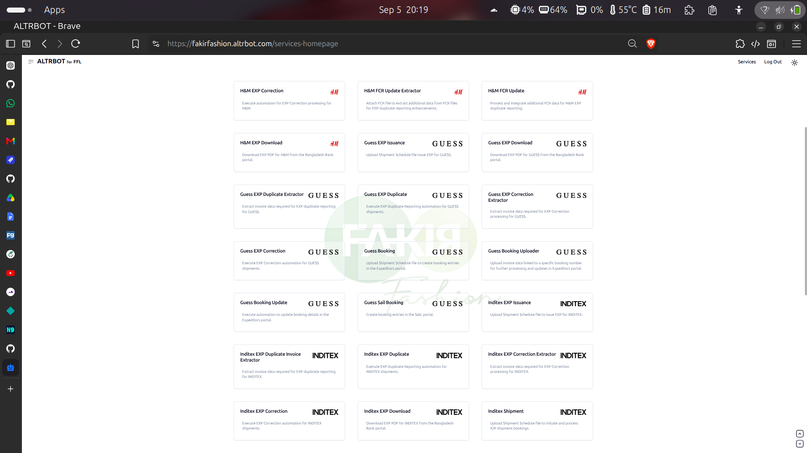

# Naimur Rahman

## Python Backend Developer | Django, FastAPI, PostgreSQL | Automation

I build Python backend systems, Django applications, and automation workflows. I am based in Bangladesh and open to international remote backend, automation, and internship roles. I am comfortable with async communication and planned timezone overlap.

  
  
  

## Skills

**Backend:** Python, Django, Django REST Framework, FastAPI, PostgreSQL, Docker 
**Automation:** Selenium, RPA, workflow automation, process control 
**Frontend:** Svelte 
**Project experience:** React, TypeScript, Firebase, MongoDB 
**Agent-assisted development:** Experienced with Codex and Claude Code as implementation tools, with a focus on reviewing and shipping working changes.

## Experiences & Works

<!--
Project screenshot instructions:

Add one small, approved screenshot beside each project description. Crop out browser chrome, private URLs, credentials, personal data, and unrelated UI. Use dummy data when a screenshot would expose real users or business information.
-->

<table>
  <tr>
    <td width="72%" valign="top" colspan=2>
      <h3><strong>Employment at <a href="https://www.altersense.com">AlterSense Ltd.</a></strong></h3>
      
<strong>Junior Software Developer</strong> · January 2026 to present · On-site 

      
<strong>Software Developer Intern</strong> · October 2025 to December 2025 · On-site

    </td>
  </tr>
    <tr>
    <td width="72%" valign="top">
      <h3>Altrbot</h3>
      
Altrbot is an AlterSense RPA product and the largest Django backend project I have worked on so far. Some of the processes we've automated for various clients are: 

      <ul>
        <li>Data extraction (Invoices, POs, etc.)</li>
        <li>Portal submissions (Booking, Issuance, etc.)</li>
      </ul>
    </td>
    <td width="28%" valign="center">
      <!-- Add an approved screenshot at assets/uar-queue-system.png. -->
      
    </td>
  </tr>
  <tr>
    <td width="72%" valign="top">
      <h3>UAR Queue System</h3>
      
A client project for managing a stream queue. The source repository is private. The project uses React, FastAPI, and MongoDB.

    </td>
    <td width="28%" valign="center">
      <!-- Add an approved screenshot at assets/uar-queue-system.png. -->
      
    </td>
  </tr>
  <tr>
    <td width="72%" valign="top">
      <h3><a href="https://spendwise29.netlify.app">SpendWise</a></h3>
      
A collaborative React and Firebase application for tracking expenses and income.

    </td>
    <td width="28%" valign="center">
      <!-- Add an approved screenshot at assets/spendwise.png. -->
      
    </td>
  </tr>
  <tr>
    <td width="72%" valign="top">
      <h3><a href="https://hiddenreads.netlify.app">Hidden Reads</a></h3>
      
A React, TypeScript, and Firebase project for organizing light novels and web novels.

    </td>
    <td width="28%" valign="bottom">
      <!-- Add an approved screenshot at assets/hidden-reads.png. -->
      
    </td>
  </tr>
</table>

## Publication

[TL-MED: Multiclass eye disease classification based on ensemble transfer learning and CRVO-BRVO detection via a single shot multibox detector](https://doi.org/10.1177/20552076251379729)

Co-author in *Digital Health*. I wrote the TensorFlow and Keras experiment code, fitted pretrained image models, and conducted the ensemble experiment.

<!--
Profile maintenance links. Keep these hidden until each item is repaired and verified.

- Hashnode: https://naimur29.hashnode.dev/
- Portfolio contact page: https://dev.naimur29.site/contact
- Former portfolio repository: https://github.com/naimur-29/professional-portfolio-site
- Quiz App: https://github.com/naimur-29/quiz-app
- AnimePahe Rebuild: https://github.com/naimur-29/animepahe-rebuild
- Get Umbrellas: https://github.com/naimur-29/get-umbrellas
- BoomEscape: https://github.com/naimur-29/BoomEscape
- AddressVault: https://github.com/naimur-29/AddressVault

Restore a project only after checking its repository, demo, README, and privacy history.
-->
